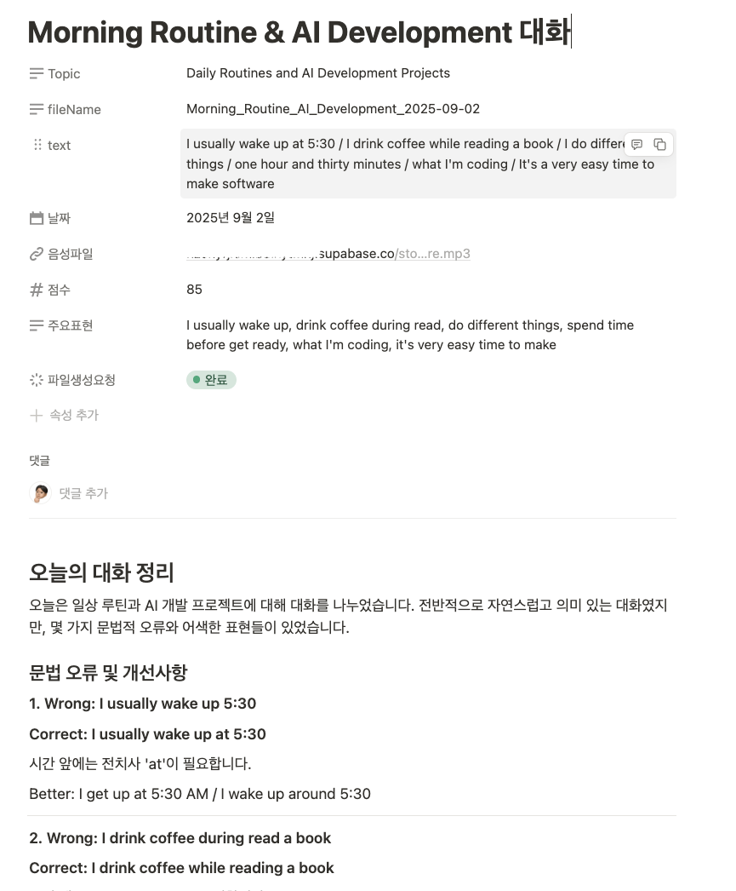

> **영어 못하는 사람의 특징**: 영어 공부는 안하고, 영어 잘하는 방법만 찾고 있음

오늘도 효율적인 영어 공부 방법은 뭘까 고민해보다가, 시대에 맞게 AI를 활용해보자는 생각이 들었습니다.

아이디어는 이렇습니다.

1. Claude에 프롬프트를 잘 넣어서, 영어 선생님으로 만든 다음, 영어로 채팅하기
2. 영어 채팅을 하면서 잘못된 표현을 첨삭 받기
3. 첨삭 내용을 노션에 저장하기
4. 노션에 저장된 첨삭 내용을 음성 파일로 만들기
5. 회사에서 점심시간엔 Claude와 영어로 채팅하고, 출퇴근 시간에는 음성 파일 듣기
6. 이를 매일 반복하면서 영어 천재되기

아이디어를 구현하기 위해 필요한 기술이 뭐가 있을지 생각해봤습니다.
1. Claude를 영어 선생님으로 만들 프롬프트 작성
2. Claude Desktop과 노션을 MCP로 연결
3. TTS로 텍스트를 음성 파일로 변환하기

그리고 Step by Step으로 만들어봤습니다.

### 1. Claude를 영어 선생님으로 만들 프롬프트 작성
#### 1) 프롬프트 만들기
1번은 그리 어렵지 않았습니다. Claude나 ChatGPT에게 'Claude와 영어 회화 공부를 하기 위한 프롬프트를 작성해주세요'로 시작하여 몇번의 대화를 주고 받았습니다. 노션에 저장하기 위한 링크 주소나, 어색한 표현이 있어도 대화 중간에 첨삭하지 말라는 등 몇가지 요구사항을 더해서 프롬프트를 완성했습니다.

<완성된 프롬프트>
``` 
당신은 나의 영어 튜터입니다. 목표는 나의 영어 말하기(채팅) 능력을 향상시키는 것입니다. 다음 학습 루프를 따르세요:

[학습 루프]
1. 오늘의 대화 주제와 핵심 표현을 제시하세요. (간단한 표현 3~5개 포함)
2. 나와 영어로 5~10문장 정도 자연스러운 대화를 나누세요.
   - 나는 영어로 답변합니다.
   - 내가 틀린 문법, 어색한 표현이 있어도 대화 중에는 고치지 말고 메모하세요.
3. 대화가 끝나면, 다음 내용을 종합 정리하여 한국어로 설명하고, 이를 노션 본문에 작성해주세요. (노션 주소: **{영어 학습 데이터를 입력할 노션 페이지 주소}**)
   - 내가 사용한 잘못된 문장 (Wrong Sentence)
   - 올바른 문장 (Corrected Sentence)
   - 왜 틀렸는지 (Explanation)
   - 자연스러운 대체 표현 또는 추천 문장 (Recommended Phrases, 영어)
4. 노션의 데이터베이스 필드에 다음의 값으로 채워주세요 
- 이름: <적절한 제목>
- 날짜: <오늘날짜>
- Topic: <오늘 대화의 주제>
- 점수: <100점 만점 중, 대화 문장의 흐름을 보고 점수 매기기>
- 주요 표현: <오늘 사용했던 주요 표현 발췌해서 정리>
- text: <본문에 작성한 Corrected Sentence, Better 표현>
- fileName: <이름_날짜>

[규칙]
- 대화는 영어로만 진행합니다.
- 정리 부분은 한국어로 설명합니다.
- 추천 표현은 네이티브가 자주 쓰는 자연스러운 문장으로 작성하세요.
- "let's start" 이라는 문장을 입력하면 학습 루프를 시작하고, "let's wrap up" 라는 문장을 입력하면 대화를 끝내고 대화내용을 종합 정리해서 학습루프에 따라 노션에 전송해주세요.
```

#### 2) 프롬프트를 Claude Desktop에 적용하기
일관된 프롬프트를 사용하기 위해, 클로드 데스크톱에서 프로젝트를 만듭니다. 


지침 수정 버튼을 눌러서, 위의 프롬프트를 입력합니다.


이제 생성된 프로젝트로 들어가서 채팅을 시작하면 항상 영어 선생님이 된 Claude와 대화를 할 수 있습니다.

### 2. MCP 로 클로드 데스크톱과 노션 연결하기
이것도 그리 어렵지 않았습니다. 노션은 워낙에 유명한 앱이라서 MCP가 잘 만들어져 있습니다.
Claude Desktop에서 커넥터를 추가하서 연결할 수도 있고, 


직접 MCP 설정 파일을 수정할수도 있습니다.
맥북에서의 경로는 '~/Library/Application Support/Claude/claude_desktop_config.json' 파일입니다.


```json
{
  "mcpServers": {
    "notion": {
      "command": "npx",
      "args": ["-y", "@suekou/mcp-notion-server"],
      "env": {
        "NOTION_API_TOKEN": **{본인 NOTION API KEY}**
      }
    }
  }
}
```

그리고 노션에 페이지와 페이지 내 데이터베이스 만들고 페이지의 링크주소를 프롬프트에 알려줍니다. 1번에서 작성했던 프롬프트에 노션 주소를 기술해줍니다.

```
3. 대화가 끝나면, 다음 내용을 종합 정리하여 한국어로 설명하고, 이를 노션 본문에 작성해주세요. (노션 주소: **{영어 학습 데이터를 입력할 노션 페이지 주소}**)
```

이제 클로드 데스크톱에서 프로젝트를 열고, *let's start* 라는 대화를 시작하면, 클로드는 친절한 영어 선생님이 되어 나와 대화를 시작합니다.
그리고 *let's wrap up* 이라고 입력하면 대화를 중단하고, 대화 내용에서 틀린 표현을 바로 잡아주고 학습해야할 내용을 정리해줍니다.

이렇게 영어로 채팅을 하는 것도 꽤 도움이 될 것으로 생각이 되었는데, 쓰다보니, 클로드가 바로 잡아준 표현을 내 것으로 만들려면 반복해서 연습이 필요하다는 생각이 들었습니다. 그래서 생각했습니다.
> "클로드가 바로 잡아 준 표현을 음성 파일로 만들어서, 자주 들으면서 반복 연습을 하면 좋겠다."

그래서 TTS로 문자를 음성으로 변환하는 여러 방법을 찾아봤습니다.
우선 클로드에게 물어봤습니다.
> **나**: 교정한 문장을 음성 파일로 만들어 줄 수 있어? 음성 파일을 만들고 노션 데이터베이스 필드를 추가해서 파일을 업로드 해줘

> **클로드**: 죄송합니다. 현재 제가 사용할 수 있는 도구들로는 음성 파일을 생성할 수 없습니다. 음성 파일 생성을 위해서는 텍스트-음성(TTS) 도구가 필요한데, 현재 저에게는 그런 기능이 제공되지 않고 있습니다.  
> 대안으로 제안드릴 수 있는 방법들:  
> 1. 온라인 TTS 서비스 이용  
> - Google Text-to-Speech  
> - Amazon Polly  
> - MS Azure Speech Services  
> - 무료 서비스: Natural REader, TTSReader 등  
> ...주저리 주저리...

기능은 Google Cloud TTS가 좋다고 해서, 우선 이것으로 시도해보기로 했습니다.
가장 쉽게 하려면 클로드와 Google Cloud TTS를 MCP로 연결해서 음성 파일을 만들고, 이걸 노션에 바로 업로드 할 수는 없을까 싶었습니다. 그런데,
> **클로드**: 안타깝게도 현재 제가 접근할 수 있는 MCP 서버들 중에는 Google Text-to-Sppech API와 연결된 것이 없습니다.

안되나 봅니다. 생각해보니, 클로드가 노션으로 파일을 직접 업로드 하는 것도 힘들 것 같습니다. 역시나,
> **클로드**: MCP(Model Context Protocol)를 통해 Notion과 연결할 수 있지만, 현재 제가 사용할 수 있는 Notion 도구들을 살펴보면 직접적인 파일 업로드 기능은 제공되지 않습니다.

그렇다면 음성 파일을 어딘가에 업로드 하고, 업로드 링크를 노션에 작성하는 방법을 취해야 할 것 같았습니다. 클로드도 Supabase Edge Function으로 Google TTS를 호출하는 서비스를 만들라고 가이드합니다. 그럼, 클로드한테 만들어 달라고 했습니다. 몇번의 대화를 통해 뚝딱 만들었습니다.

[tts-google-supabase-edge-function](https://github.com/chajs226/tts-google-supabase-edge-function.git)

Edge Function이 하는 일은  
1. 음성으로 변환할 text와 fileName을 입력으로 받아서,  
2. Google TTS 서비스로 API 호출해서 음성 데이터를 응답으로 받는데,  
3. 이를 바로 Base64 디코딩하여 오디오 바이너리 파일로 생성하고,  
4. 바이너리 파일을 Supabase Storage에 업로드 한 다음,  
5. 업로드 된 공개 URL을 응답으로 내려줍니다.

위 과정에서 Google API 키를 만들고, Supabase Storage 를 생성하고, API 호출을 위한 Key 를 만드는 방법은 기술하지 않겠습니다.;;;

curl로 요청해보면 text로 넘긴 문자가 mp3 파일로 생성되어 supabse storage에 저장된 것을 확인할 수 있었습니다.
```
curl -X POST 'https://{myProject}.supabase.co/functions/v1/tts-endpoint' \
  -H 'Authorization: Bearer {supabse api key}' \
  -H 'Content-Type: application/json' \
  -d '{"text": "Hello, this is a test.", "fileName": "test1"}'
{"success":true,"audioUrl":"https://{myProject}.supabase.co/storage/v1/object/public/audio-files/test1.mp3","fileName":"test1.mp3","textLength":22,"audioSize":17088,"timestamp":"2025-08-29T07:55:46.131Z"
```

클로드와 supabse를 MCP로 연결해서 Edge Function을 호출하고, 리턴 받은 파일의 공개 url을 노션 필드에 저장하면 되겠다 생각했는데, 또 문제가 생겼습니다.
클로드가 자기는 edge function을 호출할 수 없다고 합니다.

> **클로드**: 아니요, 현재 제가 사용할 수 있는 Supabase MCP 도구들로는 Edge Function을 직접 호출하고 응답을 받을 수는 없습니다.  
> 현재 사용 가능한 Supabase MCP 기능들:
> Edge Function 배포 (deploy_edge_function), Edge Function 목록 조회 (list_edge_functions)
> 데이터베이스 쿼리 및 마이그레이션, 로그 조회, 프로젝트 설정 확인  
> Edge Function 호출이 불가능한 이유:
> 현재 MCP 도구는 Supabase 관리 기능에 초점이 맞춰져 있고, 실제 Edge Function의 HTTP 엔드포인트를 호출하는 기능은 포함되어 있지 않습니다.  
> 대안적인 방법:
> 웹 검색/페치 도구 활용: Edge Function이 공개 엔드포인트라면 web_fetch 도구로 호출 가능
> 예: https://your-project.supabase.co/functions/v1/your-function

아놔....
web_fetch도 GET 요청만 가능하다고 해서, 클로드에서 직접 Edge Function을 실행하는 방법은 없는 것 같습니다. ㅠㅠ

그래서 긴 대화 끝에 클로드의 짐을 덜어주기로 했습니다. 클로드는 노션에 대화 내용을 정리하는 것 까지만 하고, 나머지는 노션에게 책임을 넘기기로.

노션에서 버튼을 클릭하거나, 상태 값을 바꿨을 때, Edge Fucntion을 호출해서 리턴받은 공개 URL을 필드에 없데이트 하기로했습니다. 노션 데이터 변경을 감지해서 외부로 요청을 보내기 위해서는 n8n이나 zapier, make 같은 툴을 사용해야 된다고 합니다.

저는 가장 사용하기 쉽다고 하는 zapier를 적용해봤습니다. 사용량이 많아지면 비용이 발생하겠지만, 하루에 한번 요청 정도는 크게 문제가 없을 것 같아서 우선 구현하기 쉬운 방법을 택했습니다.

Zapier 파이프 라인


1. 웹푹을 캐치할 URL을 만들고,


2. SUPABASE Edge Function 호출 정보 입력


3. Update할 노션의 데이터베이스 row 조회 


4. 노션 업데이트


그리고 노션의 데이터베이스에 자동화 기능을 활성화 시킵니다.
데이터베이스 '파일생성요청'필드의 상태를 완료로 설정하면 Zapier로 웹훅을 보내고, Zapier 파이프라인에 따라 업로드 된 음성 파일 url이 노션 데이터베이스에 업데이트 됩니다.


이제 클로드와 영어로 대화를 하고 나면, 대화에서 개선해야할 사항을 노션에 정리하고, 노션의 상태 값을 변경 시키면, 이를 음성파일로 만들어서 링크주소를 갖게 됩니다. 


이제 열심히 공부만 하면 되겠습니다.